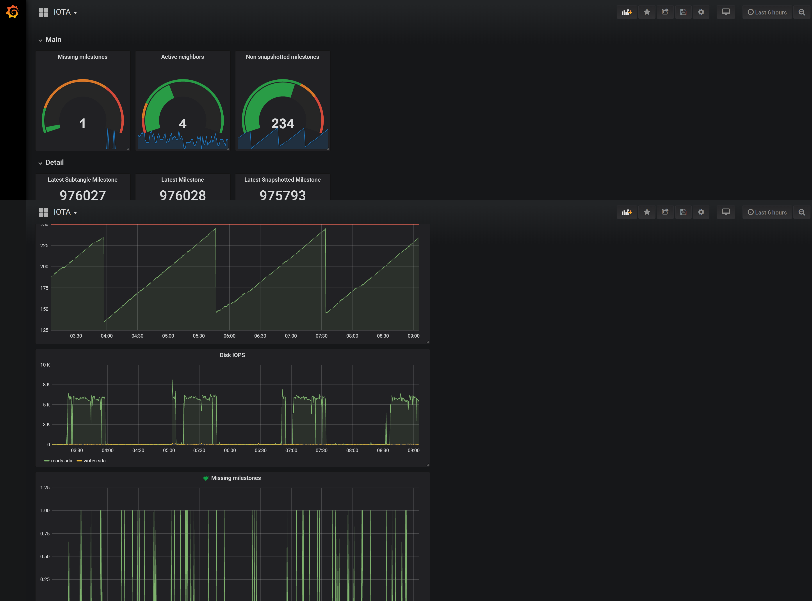

# Prometheus DHCP Exporter

[](LICENSE)  [](https://img.shields.io/badge/stability-alpha-yellow.svg)

[](https://crates.io/crates/prometheus_iota_exporter) [](https://crates.io/crates/prometheus_iota_exporter) [](https://crates.io/crates/prometheus_iota_exporter)

[](https://github.com/MindFlavor/prometheus_iota_exporter/tree/0.1.0)
[](https://github.com/MindFlavor/prometheus_iota_exporter/tree/0.1.0)
[](https://img.shields.io/github/commits-since/mindflavor/prometheus_iota_exporter/0.1.0.svg)

## Intro
A Rust Prometheus exporter for IOTA (Iri) server. This tool exports the information provided by the Iri server API in a format that [Prometheus](https://prometheus.io/) can understand. It's a Rust-only clone of this exporter: [https://github.com/crholliday/iota-prom-exporter](https://github.com/crholliday/iota-prom-exporter). While this tool does not currently support all the metrics supported by the aoforementioned exporter it does not require NodeJS so it's easier to deploy on servers. Being Rust, the memory footprint is small (as it should be for such a simple tool). This library also exports the *last snapshotted* milestone so you can visually check if the new automatic snapshotting functionality works: 



## Prerequisites 

* You need [Rust](https://www.rust-lang.org/) to compile this code. Simply follow the instructions on Rust's website to install the toolchain. If you get wierd errors while compiling please try and update your Rust version (I have developed it on `rustc 1.33.0-nightly (ceb251214 2019-01-16)`). 

## Compilation

To compile the latest master version:

```bash
git clone https://github.com/MindFlavor/prometheus_iota_exporter.git
cd prometheus_iota_exporter
cargo install --path .
```

If you want the latest release you can simply use:

```bash
cargo install prometheus_iota_exporter
```

## Usage

Start the binary with `-h` to get the complete syntax. There parameters are:

| Parameter | Mandatory | Valid values | Default | Description |
| -- | -- | -- | -- |
| `-v` | no | <switch> | | Enable verbose mode.
| `-p` | no | any valid port number | 9978 | Specify the serivce port. This is the port your Prometheus instance should point to.
| `-a` | yes | Your IRI management URL | | This is your IRI management port. Right now the tool does not support authentication so localhost is a good choice.
| `-n` | no | <switch> | | If specified, the tool does not query for neighbors information. The output will be less informative but this is useful if you do not need the info.

Once started, the tool will listen on the specified port (or the default one, 9978, if not specified) and return a Prometheus valid response at the url `/metrics`. So to check if the tool is working properly simply browse the `http://localhost:9978` (or whichever port you choose).

Now add the exporter to the Prometheus exporters as usual. I recommend to start it as a service. My systemtd service file is like this one:

```
[Unit]
Description=Prometheus IOTA Exporter
Wants=network-online.target
After=network-online.target

[Service]
User=node_exporter
Group=node_exporter
Type=simple
ExecStart=/usr/local/bin/prometheus_iota_exporter -a http://localhost:14267 -p 9978

[Install]
WantedBy=multi-user.target
```

